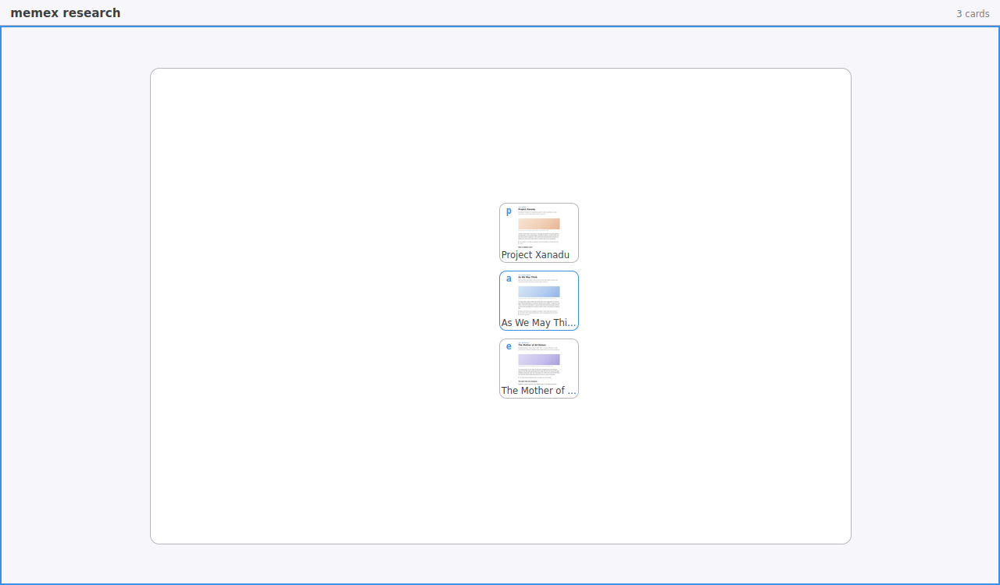

# Frontier OpenSearch

A browser built on the idea that research is not a single thread.

An independent fork of Firefox, rebuilt around three ideas that replace the tab
strip, the back button, and the history list.

> **Status: early.** This repository is under active construction. Nothing here
> is stable, and the browser is not yet usable as a daily driver.

## The three pillars

**The Field** replaces the tab strip. Every open page is a live card on an
infinite zoomable canvas, clustered automatically by where it came from. Zoom out
to see everything you have open at once; zoom in and a page fills the window.

**Trails** replace linear history. Navigation is a tree, not a list. Going back
never destroys the branch you came from — it stays visible as a sibling you can
re-enter. Trails are objects: nameable, saveable, exportable.

**The Context Engine** replaces the flat history database. A local store records
what you asked, what answered it, and what you did next, and clusters that into
research contexts. Suggestions rank by the context you are in rather than by
global visit frequency. Any context can be exported as a markdown brief.

Everything is local. There is no account, no sync service, and no telemetry.
And because a record you cannot remove is not private just for staying on your
machine, everything the Context Engine holds is cleared by the browser's own
Clear Recent History and Forget About This Site — for a site, for a time range,
or entirely.

## What it looks like

Every picture below was taken by the browser itself, driving a real session
over the pages in `browser/components/fos/tests/browser/fixtures/`. Run
`./agent/smoke.sh` to regenerate all of them.

**Trails.** Navigation is a tree. This reader searched, opened *As We May
Think*, went to *Project Xanadu*, came back, and went to *The Mother of All
Demos* instead. In a linear history the second of those destroys the first;
here both are siblings, and either can be re-entered with its scroll position
intact. The letter beside each page is its mark — type it anywhere to go there.


**The Field.** Every open page is a card, and cards are grouped by the trail
they came from — not by the order the tabs were opened in. Zoom out and two
separate enquiries are two separate regions.


Zoom into one and it is that enquiry alone, each card in the place its
provenance put it.



**One entry surface.** There is no separate URL bar, search box, or menu for
any of this. One bar takes a search, a URL, a command, a page mark, or a
context, under one grammar — and the same grammar is what a voice or dwell
path drives, with no separate accessibility mode.

**Ranked by what you are working on.** The bar offers pages from the enquiry in
play before pages you merely visit often, and it says which tier each
suggestion came from rather than presenting one opaque list.


**The Context Engine.** What you asked, what answered it, and what the pages
were about — held locally, per research context, and exportable as a markdown
brief written to be pasted into a language model.


## Building

Requires roughly 40GB of free disk and 16GB of RAM.

```bash
git clone https://github.com/gavinwunz/frontieropensearch
cd frontieropensearch
./mach bootstrap        # choose "Firefox for Desktop"
./mach build
./mach run
```

For frontend-only changes, `./mach build faster && ./mach run` takes minutes
rather than hours.

## Licence and attribution

This project is a fork of Mozilla Firefox and is licensed under the
[Mozilla Public License 2.0](LICENSE). All MPL headers in inherited files are
preserved.

Frontier OpenSearch is **not** affiliated with, endorsed by, or sponsored by
Mozilla. Firefox and Mozilla are trademarks of the Mozilla Foundation, used here
only to describe the origin of this code. It is likewise unaffiliated with the
OpenSearch project (opensearch.org), Amazon, Elastic, or the OpenSearch
description format.

## Documentation

| Document | What it covers |
| --- | --- |
| [`design/ARCHITECTURE.md`](design/ARCHITECTURE.md) | How the three pillars fit together — start here |
| [`design/FIELD.md`](design/FIELD.md) | The Field: cards, regions, zoom levels |
| [`design/GRAMMAR.md`](design/GRAMMAR.md) | The command bar, marks, and one parse path for keyboard and voice |
| [`design/SYSTEM.md`](design/SYSTEM.md) | The design system every chrome surface is styled from |
| [`context-engine/SCHEMA.md`](context-engine/SCHEMA.md) | The Context Engine's data layer |

The research log — every interface idea considered, adopted, or rejected, with
reasons — is in `agent/IDEAS.md` and is probably the most interesting file in
the repository.

`./agent/smoke.sh` drives the whole demo end to end in a real browser — search,
branch three ways, zoom out to the Field, switch context, export a context pack
— and writes the screenshots above, plus one per stage of the demo and the
exported brief itself, to `agent/reports/`.
