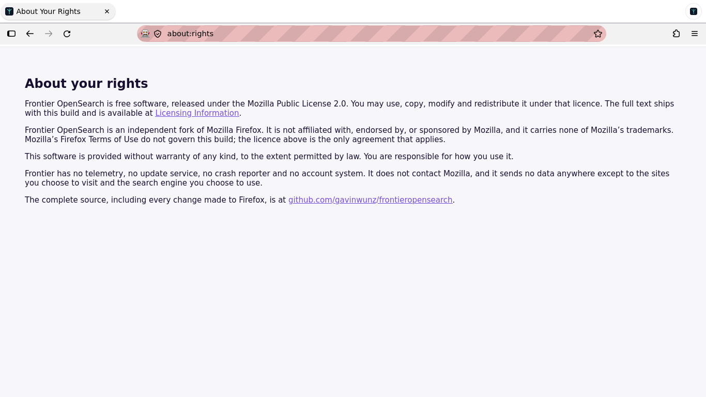
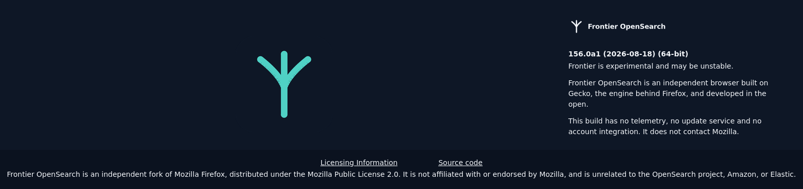
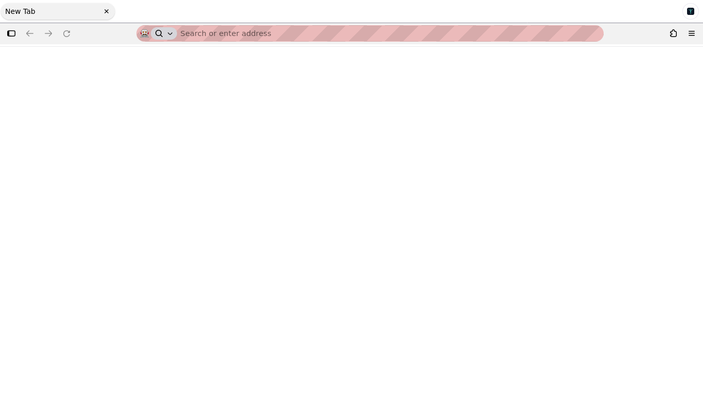

# Phase 1 — Rebrand: complete

**Date:** 2026-08-18
**Branch:** `agent/dev` → merged to `main`
**Acceptance criteria:** browser launches with the new name and icon, about
dialog is correct, no user-visible "Firefox" in first-run surfaces. **All met.**

---

## How this was verified

Not by grepping the tree. The build was launched headless on a **fresh profile**
with `MOZ_REMOTE_ALLOW_SYSTEM_ACCESS=1`, and every surface was read out of the
running browser's own DOM — chrome window, app menu, menubar, about dialog,
`about:preferences` pane by pane, `about:rights`, `about:welcome`.

The distinction mattered. A first pass that read `documentElement.textContent`
reported "Extended Support Release" and a duplicated donation line as problems;
both are `hidden` elements that never render. Re-running the sweep against
`getBoundingClientRect()` and computed style dropped them. Everything listed
below is a string that a user could actually see.

## What was found and fixed

### `about:rights` fetched Mozilla's terms over the network

The most serious finding, and one no amount of string-grepping would have
surfaced. `AboutRedirector.cpp` mapped `rights` to
`https://www.mozilla.org/about/legal/terms/firefox/`, so opening it on a fresh
profile made a live request to Mozilla and rendered *"Firefox Terms of Use —
Mozilla"*: a binding agreement between the reader and Mozilla Corporation,
presented as though it governed this build. It does not.

Replaced with a local chrome page, `browser/base/content/aboutRights.xhtml`. No
network, and it states only what is true — MPL 2.0, not affiliated with Mozilla,
no warranty, no telemetry or account system, and where the source is.

### The about dialog pointed at mozilla.org in four places

The product name itself was hyperlinked to mozilla.org; the footer offered
Mozilla's Terms of Use and Privacy Notice; the body solicited donations to the
Mozilla Foundation and linked `about:credits`, which is another redirect to
mozilla.org.

All replaced. The element ids stayed as they were, because `aboutDialog.js`
toggles them by id. The remaining links are `about:license` and the project
repository.

The Mozilla and Firefox mentions still in the dialog are deliberate: the MPL
attribution and the statement that the fork is *not* affiliated with Mozilla.
Removing those would be dishonest, not more thoroughly rebranded.

The wordmark in that screenshot is a fix from this run too — the generated SVG
had a `viewBox` 57px narrower than its own text, so the shipped dialog read
**"Frontier OpenSea"**. The width is now derived from the measured advance with
headroom for systems where `system-ui` resolves differently.

### Telemetry was on, and a pref could not switch it off

A fresh profile reported `toolkit.telemetry.enabled=true` with
`canRecordExtended=true`, despite the branding pref file setting it false.

The pref never had a chance. `PreferencesImpl::SetupTelemetryPref` derives the
default from the compile-time update channel — a local build lands on `default`,
which upstream treats as pre-release — and then calls `Preferences::Lock`. The
lock beats any pref file.

Nothing was being uploaded: the build has no `MOZ_TELEMETRY_REPORTING` and data
submission is off. But extended data was being collected in-process, so
`about:rights` would have been claiming something false. Fixed in
`TelemetryPrefValue()`, where the lock cannot override it. `canRecordBase` and
`canRecordExtended` are both `false` on a fresh profile now, and the pref-file
line was removed rather than left as a guarantee it could not give.

### Mozilla services and product adverts reachable from the UI

Found in Settings and the Tools menu: a "Sign in" button on first run (Firefox
Accounts), "Suggest Firefox Relay email masks", "Mozilla VPN", "Mozilla
Monitor", and the Firefox mobile-app promo. Each is a Mozilla service with a
network path to Mozilla. Switched off by pref rather than rebranded, since the
fork has no account system and does not advertise.

`Firefox View`, `Firefox Home` and `Firefox Labs` are feature *brand terms* in
`toolkit/.../brandings.ftl`, so they were fixed there rather than by touching
any consuming string.

## Final state

Sweep of the running browser on a fresh profile, visible strings only:

| Surface | Firefox/Mozilla mentions |
|---|---|
| Browser window + app menu | none |
| Menubar, including submenus | none |
| `about:preferences`, all six panes | none |
| About dialog | 3, all deliberate MPL attribution |
| `about:rights` | local page, attribution only, no network |

Prefs on a fresh profile: `canRecordBase=false`, `canRecordExtended=false`,
`toolkit.telemetry.unified=false`, `datareporting.*=false`,
`signon.firefoxRelay.feature="disabled"`, `identity.fxaccounts.enabled=false`,
`app.update.auto=false`.

## Caveat, stated plainly

The **window-manager / taskbar icon** is not verified. The about dialog renders
the fork's logo, the tab favicon on `about:rights` is the fork's mark, and the
packaged `default*.png` hash to the branding directory's own files — but the
icon a desktop environment shows in a titlebar or dock can only be confirmed in
a real X session. There is no Xvfb on this machine, and the one display present
is Gavin's actual desktop, which must not be captured. Everything an icon can be
checked for without that is checked.
