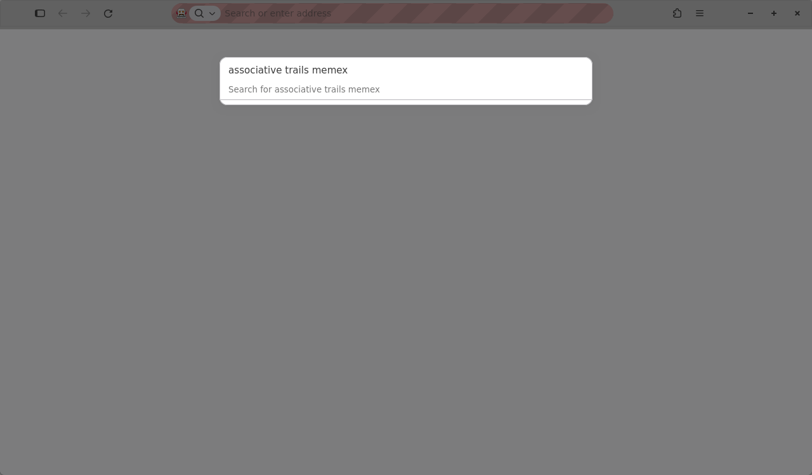
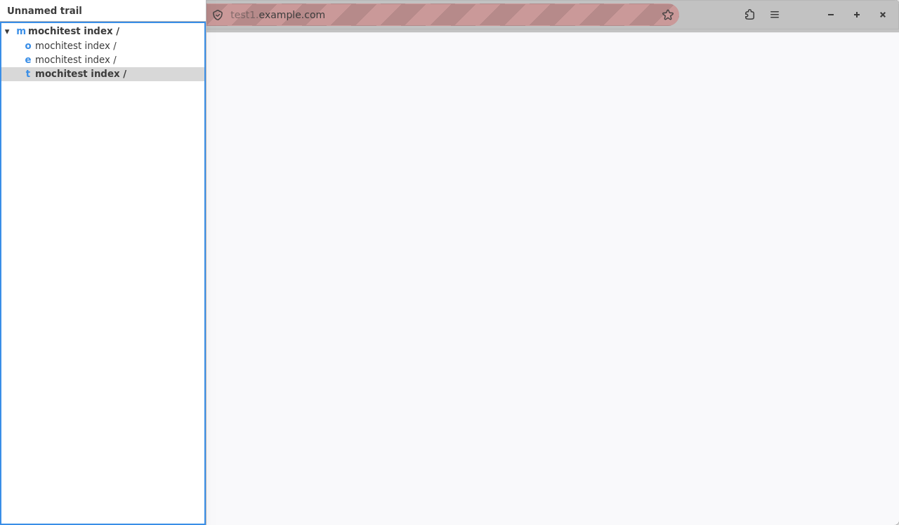
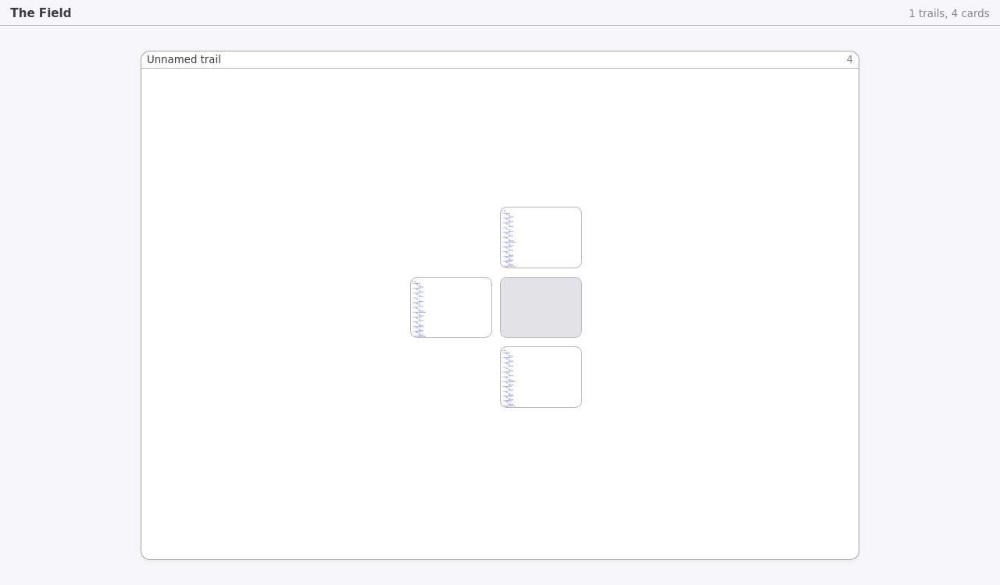
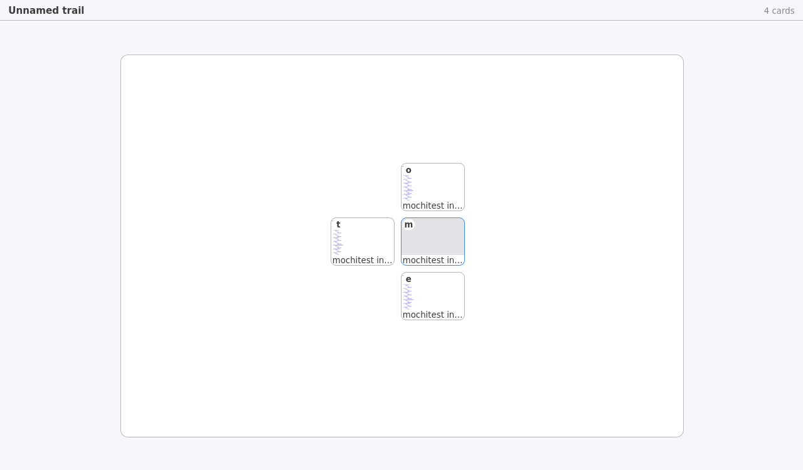
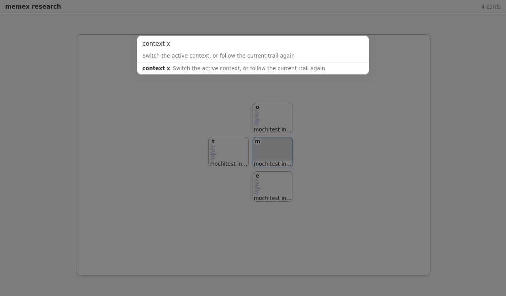
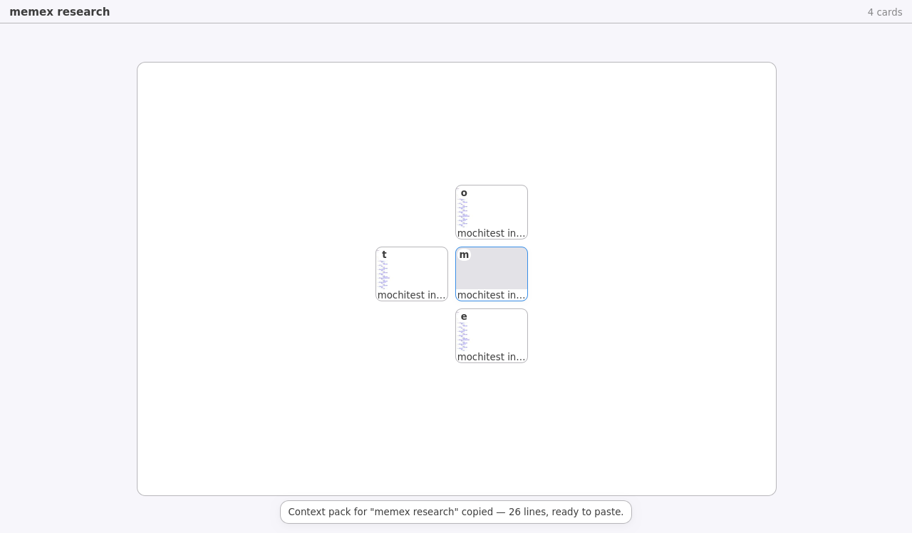

# Phase 2 — The novel UI

**Status: complete.** The phase's acceptance criterion — "a single demo flow
works end to end — search, branch three ways, zoom out to the Field, switch
context, export a context pack" — runs as one automated browser-chrome test,
`browser/components/fos/tests/browser/browser_zdemoflow.js`, in one sequence,
in its own chrome window.

Suite at the close of the phase:

| Harness | Checks | Result |
| --- | --- | --- |
| `node --test` (pure view models, parser, tree, pack, signals) | 179 | green |
| xpcshell (schema, migrations, store, Field model) | 2 files | green |
| browser-chrome (`browser/components/fos/`) | 335 | green |
| upstream tab tests | 193 of 194 | one pre-existing failure, not ours |

## The three pillars

**A. The Field** replaces the tab strip. The strip is gone — `TabBarVisibility`
treats the Field as "tabs displayed elsewhere", the same clause vertical tabs
stands on — and `browser.fos.field.replacesTabStrip=false` brings it back.
Regions are trails, cards are seeded by provenance, and the overview scales to
fit with nothing to pan to.

**B. Trails** replace linear history. Navigation is a tree; going back never
truncates the forward branch, because re-entry replays a stored SessionStore
blob rather than calling `gotoIndex`. Trails survive a restart, are nameable,
and carry scroll and form state back with them.

**C. The Context Engine** replaces flat history and the awesomebar. A local
SQLite store records queries, visits, entities and contexts; it surfaces as the
command bar's ranking (five tiers, each boundary a fact rather than a
coefficient), the context sidebar, and `pack`.

**One entry surface.** The command bar owns search, URL, commands, trail-jump
and context-switch, over one action table that is the single source of both the
typed and the spoken grammar. The address bar keeps origin display — a security
boundary this project should not re-earn — and refuses input.

## The demo flow, stage by stage

### 1. Search



Prose typed into the one entry surface. The status line commits to what Enter
will do before it is pressed.

### 2. Branch three ways



Three times: go somewhere from the search result, re-enter the search result,
go somewhere else. In a linear-history browser the second of those destroys the
first. The rail shows the root `m` with all three branches — `o`, `e`, `t` —
intact as siblings.

### 3. Zoom out to the Field





F2 from the page. The overview holds every region; zooming in shows the whole
enquiry at once, each card carrying the same letter that addresses it from the
rail and from the command bar.

### 4. Switch context



The enquiry is named, which is what promotes its context to something
addressable. `context <mark>` switches to it from a tab that was never on its
trail; bare `context` hands the decision back to provenance.

### 5. Export a context pack



The full export is in [`demo-pack.md`](demo-pack.md):

```markdown
# Context pack — memex research

Research context **memex research**: 1 question asked, 4 pages opened.

## Questions asked

- associative trails memex

## Pages

### Skimmed or abandoned

- [mochitest index /](https://example.com/?q=associative+trails+memex) — trail "memex research"
- [mochitest index /](https://example.org/) — 1s — trail "memex research"
...
```

## What the flow found that six green files could not

The five stages were each already covered, each from state its own file set up.
Running them as one sequence found three things in the first hour:

1. **A query never joined its own context.** A query took its context from
   whatever was active when it was issued, and for the commonest case there is
   none — a search typed into a fresh tab is recorded before the page arrives,
   so the context does not exist yet. Every pack of an enquiry that started
   with a search reported "0 questions asked". Fixed: a query joins the context
   of the page it opened, at the seam that already existed for attaching it to
   that page.

2. **A pinned context could never be released.** `context <mark>` pins, and a
   pin deliberately survives the next navigation. Nothing released it, so it
   survived every navigation: one deliberate switch ranked the bar and aimed
   `what` and `pack` at that enquiry for the rest of the session. Fixed: the
   verb's target is optional and the bare form follows provenance again, as
   bare `back` applies to where you already are.

3. **A key struck with content focused round-trips through the content
   process** before it reaches the chrome keyset, so F2 is asynchronous from
   the test's point of view. Not a defect — but every assertion written against
   it as a synchronous call was testing IPC latency.

## Licence and trademark

This is a fork of Firefox, MPL 2.0, with every MPL header and the LICENSE file
intact. No user-visible surface of the build presents itself as Firefox; see
`agent/reports/phase-1.md` for the verified surface-by-surface table.
