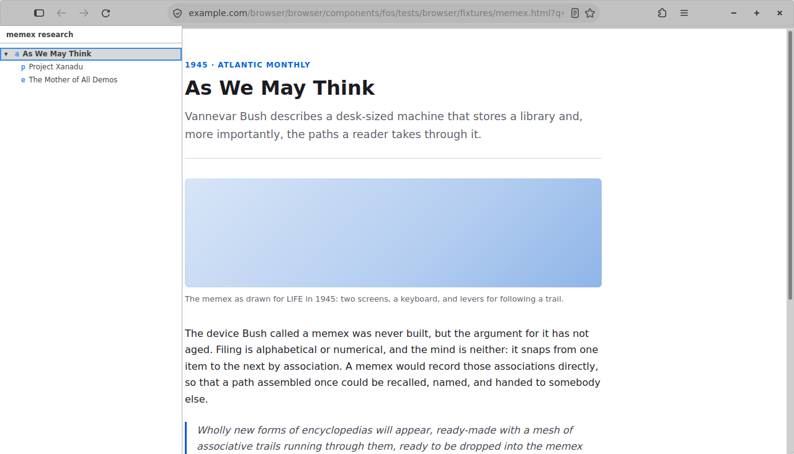
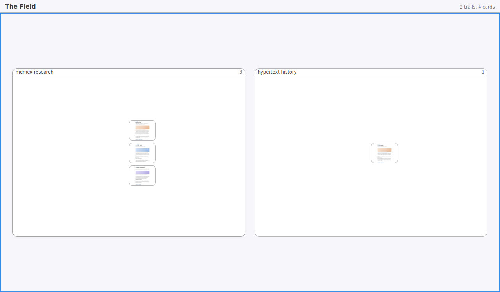
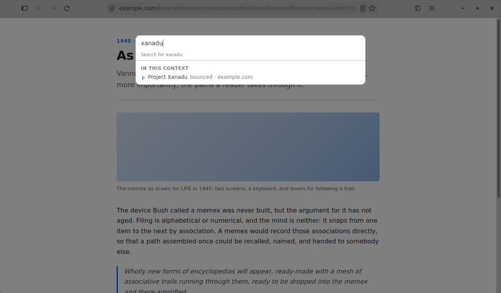
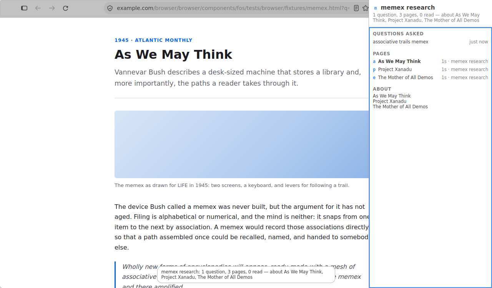

# Phase 3 — Beautiful and tested

**Status: complete.** The phase's acceptance criterion — "full suite green on
two consecutive runs, screenshots captured, README complete" — is met. Run 18
closed green and run 19 closed green, on a tree run 19 changed.

| Harness | Checks | Result |
| --- | --- | --- |
| `node --test` (pure view models, parser, tree, pack, signals, suggest) | 182 | green |
| xpcshell (schema, migrations, store, Field model at session scale) | 2 files, 64 checks | green |
| browser-chrome (`browser/components/fos/`, 11 files) | 504 | green |
| upstream tab tests | 193 of 194 | one pre-existing failure, not ours |

Everything here runs from `./mach test browser/components/fos/` plus
`./browser/components/fos/tests/node/run.sh`. The end-to-end run is
`./agent/smoke.sh`, which drives the demo flow and a second longer session and
writes eleven screenshots and the exported brief to `agent/reports/`.

## What "beautiful" turned out to mean

The phase plan asked for "one coherent design system (spacing, type scale, dark
+ light), 60fps canvas pan and zoom, no layout jank". Each of those was a real
defect once it was measured, and none of them was the defect it looked like.

**The type scale.** `design/SYSTEM.md` is the contract and
`browser/components/fos/content/fos-tokens.css` is the declaration. The
headline find was that chrome has no small-text token at all: upstream sets
`font.size.small` to `unset` for chrome deliberately, so twenty-two
declarations across four surfaces asked for secondary text and rendered body
text. Every stylesheet was valid, every lint was clean, and the whole fork
rendered at one size. That is why the system's test asserts that a token
*resolves to something* in a running window rather than that a stylesheet
mentions it.

**Spacing.** The first version of the system settled the inline gutter and said
nothing about the block axis, and four surfaces then answered it four ways. The
rail and the sidebar are open at the same time on either side of the page,
listing the same nodes, at visibly different line rhythms; the sidebar's entity
list, at no rhythm at all, rendered as a paragraph. Three tokens now, one role
each.

**Dark and light.** No FOS stylesheet contains a literal colour. Every surface
is on the platform token set, so dark mode, high contrast and forced colours
arrive already mapped — which is also why `SelectedItem` is what a selected row
becomes under forced colours without anything in this fork saying so.

**Focus.** All three focusable containers fill the window, so the focus ring was
an accent rectangle 700px tall down the side of the browser, next to a row
shaded 20% grey — the loudest mark in the surface pointing at the box rather
than at the page Enter would open. The ring is on the row now. Two things that
cost were invisible to reading: the rule being replaced was *overriding* the UA
stylesheet's own ring rather than adding one, and a programmatic focus inherits
the window's pointer-or-keyboard mode, so a surface opened after a click took
every keystroke off the page and showed no sign of having done so.

**60fps.** Measured, in `browser_zzfieldperf.js`, one pointer move per animation
frame. The drag was never the problem: at 40 cards carrying thumbnails a move
is 1.5ms of script and 0.01ms of layout, and 60 consecutive frames arrived at
the display's own 17.08ms cadence with none dropped. The cost was `render`,
called unthrottled by the resize listener — on the worst case the design
permits, ten resize events in one tick cost 53ms, taking the frame interval
during a window drag to a p95 of 65ms against 23ms with the Field closed.
Coalesced to one render per frame, the burst is 7.6ms. Two plausible
optimisations were rejected on the measurement rather than adopted on the
guess; `agent/IDEAS.md` run 18 has both.

## What it looks like

The rail, one search branched two ways. The selected row carries the ring; the
current node carries the accent rule down its edge.

The Field, zoomed out to every enquiry at once and zoomed into one.

The command bar ranking by active context, printing the tier each suggestion
came from.

The context sidebar: what was asked, what answered it, what it is about.

## Tests

- **Unit tests for the context engine** — schema and migrations, the store's
  writes and reads, clustering into contexts, and the markdown export, across
  `tests/unit/test_contextstore.js` and the node suite's `test_contextpack.mjs`
  and `test_contextsignals.mjs`.
- **Browser-chrome for trails and the Field** — `browser_trailrail.js` proves
  pillar B's promise against Gecko's own session history, which would otherwise
  truncate the forward branch; `browser_field.js` and `tests/unit/test_field.js`
  carry `FIELD.md` §9's five acceptance properties at session scale.
- **A scripted end-to-end smoke run** — `agent/smoke.sh`, which drives the demo
  flow and saves screenshots. Both photographing files are ordinary
  browser-chrome tests that write nothing unless `FOS_SHOTS` names a directory,
  so a capture is never out of date without the suite noticing.

## README

Real screenshots, taken by the browser itself over pages worth reading; build
instructions; `design/ARCHITECTURE.md` for the three pillars; and the MPL and
trademark notes, including that this fork is unaffiliated with the OpenSearch
project as well as with Mozilla.

## The method, in one line

Every number in this phase has a control beside it, and every visual claim was
checked by opening the picture. The two most expensive bugs the project has
shipped — a token that resolved to nothing, and a CSS rule that was removing
something rather than adding it — were both invisible to a correct reading of a
correct file, and both took one line of computed style to see.
